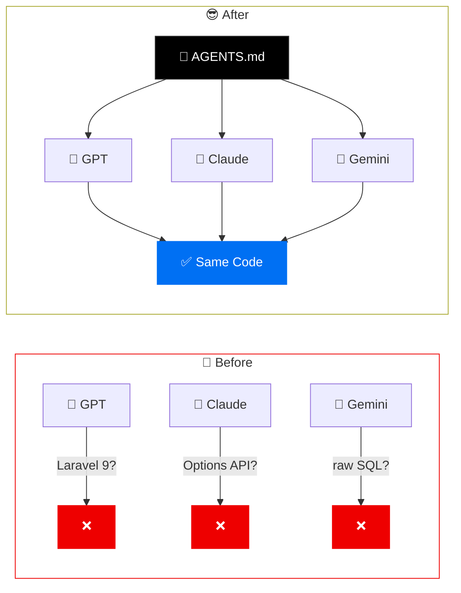
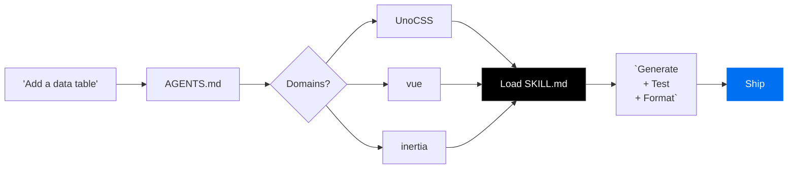
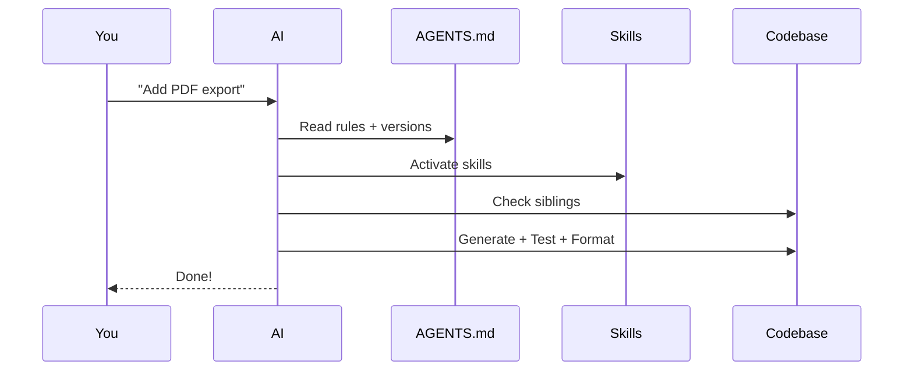

# How I Orchestrated a Full-Stack<br/>Laravel & Vue Project via AI

<div v-motion :initial="{ y: 40, opacity: 0 }" :enter="{ y: 0, opacity: 1, transition: { delay: 400 } }">

## <span v-mark.highlight.yellow="1">with Near-Zero Bugs</span>

</div>

<div v-motion :initial="{ opacity: 0 }" :enter="{ opacity: 0.5, transition: { delay: 800 } }" class="mt-12 text-sm">
  Making AI your <strong>most disciplined</strong> team member
</div>

---

# The Stack

<div class="grid grid-cols-4 gap-10 mt-8">
  <div v-click class="flex flex-col items-center gap-2">
    <logos-laravel class="text-5xl" />
    <div class="font-bold">Laravel 12</div>
  </div>
  <div v-click class="flex flex-col items-center gap-2">
    <logos-vue class="text-5xl" />
    <div class="font-bold">Vue 3</div>
  </div>
  <div v-click class="flex flex-col items-center gap-2">
    <simple-icons-inertia class="text-5xl" />
    <div class="font-bold">Inertia v2</div>
  </div>
  <div v-click class="flex flex-col items-center gap-2">
    <logos-tailwindcss-icon class="text-5xl" />
    <div class="font-bold">Tailwind v4</div>
  </div>
</div>

<div v-click class="mt-10 text-sm opacity-50">
  + Sail + Pest 4 + Wayfinder + shadcn-vue + Reverb + Horizon
</div>

---

# The Problem

<v-clicks>

- <span v-mark.strike-through.red="1">Inconsistent code</span> - different patterns every time
- <span v-mark.strike-through.red="2">Wrong versions</span> - suggests Laravel 9 APIs
- <span v-mark.strike-through.red="3">Style drift</span> - every component looks different
- <span v-mark.strike-through.red="4">Skips tests</span> - "ship it" energy

</v-clicks>

<div v-click v-motion :initial="{ scale: 0.9, opacity: 0 }" :enter="{ scale: 1, opacity: 1 }">
<div class="mt-8 px-8 py-4 bg-red-500/10 border border-red-500/30 rounded-lg text-center text-lg">
  Without guardrails, AI is a <span v-mark.box.red="6">junior dev who never reads the docs</span>.
</div>
</div>

---

# The Fix

<div class="grid grid-cols-2 gap-6">
<div>

<v-clicks>

- **`AGENTS.md`** = <span v-mark.underline.green>the constitution</span>

  - Stack versions, conventions, rules

- **`.agents/skills/`** = <span v-mark.underline.green>domain experts</span>

  - Auto-activate per domain

- **`skills-lock.json`** = <span v-mark.underline.green>reproducibility</span>
  - Content hashes, like package-lock

</v-clicks>

</div>
<div v-click>



</div>
</div>

---

# AGENTS.md + Version Pinning

<div class="grid grid-cols-2 gap-6 mt-2">
<div>

```md {all|5-8|10-12|14-16}{lines:true}
=== foundation rules ===

# Laravel Boost Guidelines

## Foundational Context

- php - v8.5.4
- laravel/framework - v12

## Skills Activation

- wayfinder, pest-testing

## Conventions

- Check sibling files first
```

<div v-click class="mt-2 text-sm">

Same file: `AGENTS.md` = `CLAUDE.md` = `GEMINI.md`<br/>
<span v-mark.highlight.yellow>One rulebook, all AIs</span>

</div>

</div>
<div>

<v-switch>
<template #1>

### Without pinning

```php
// AI generates Laravel 10 code
protected $casts = [
    'email_verified_at' => 'datetime',
];
```

```php
// Kernel.php (removed in L11!)
class Kernel extends HttpKernel {
    protected $middleware = [...];
}
```

</template>
<template #2>

### With pinning

```php
// AI generates Laravel 12 code
protected function casts(): array
{
    return [
        'email_verified_at' => 'datetime',
    ];
}
```

```php
// bootstrap/app.php
Application::configure()
    ->withMiddleware(function ($m) {
        $m->web(append: [...]);
    });
```

</template>
</v-switch>

</div>
</div>

---

# Skills = Auto-Activating Experts

```md {all|2|3|4}
## Skills Activation

- wayfinder -> typed routes in frontend
- pest-testing -> writing tests, TDD
- UnoCSS -> any styling work
```

<div v-click class="mt-4">



</div>

<div v-click class="mt-2 text-center text-sm opacity-60">
Each skill = a SKILL.md with patterns + dos and donts
</div>

---

# Consistent UnoCSS

<div class="grid grid-cols-2 gap-6 mt-2">
<div>

```ts {all|2-3|8-10|12-16}
// uno.config.ts
import { defineConfig, presetWind, presetIcons } from "unocss";

export default defineConfig({
  presets: [
    presetWind(),
    presetIcons({
      scale: 1.2,
      collections: { lucide: () => import("...") },
    }),
  ],
  shortcuts: {
    btn: "px-4 py-2 rounded-md font-medium",
    "btn-primary": "btn bg-primary text-white",
    "card-base": "rounded-lg border bg-card p-6",
  },
});
```

<div v-click class="text-sm mt-2">

UnoCSS skill = <span v-mark.underline.green>style police</span>

</div>

</div>
<div>

<v-clicks>

- **Shortcuts** — reusable token combos
- **Icons as classes** — `i-lucide-users`
- AI uses <span v-mark.underline.green>shortcuts over raw utilities</span>

</v-clicks>

<div v-click class="mt-4">

```html
<!-- Without UnoCSS skill -->
<button
  class="px-4 py-2 rounded-md
  font-medium bg-indigo-600 text-white
  hover:bg-indigo-700"
>
  Save
</button>

<!-- With UnoCSS skill -->
<button class="btn-primary">Save</button>
<span class="i-lucide-check" />
```

</div>

</div>
</div>

---

# The Real App

<v-clicks>

- **40+ Vue components** - one style
- **AppShell + Sidebar** wrappers
- **shadcn-vue** everywhere
- **All AI-generated**

</v-clicks>

<div v-click class="mt-6 text-xs opacity-50">
Built with AI. In production. Real users.
</div>

---

# LLM Builds Full Pages

<div class="grid grid-cols-2 gap-6 mt-2">
<div>

**You say:**

> "Create a dashboard with user stats"

<div v-click class="mt-2">

**AI knows the building blocks:**

```
@/components/ui/
├── card/        ← CardHeader, CardTitle...
├── button/      ← variants: default, outline
├── badge/       ← status indicators
├── table/       ← data display
├── dialog/      ← modals
├── sidebar/     ← navigation
└── 40+ more...
```

</div>

</div>
<div v-click>

**AI generates:**

```vue
<script setup lang="ts">
import AppLayout from "@/layouts/AppLayout.vue";
import { Card, CardHeader, CardTitle } from "@/components/ui/card";
import { Badge } from "@/components/ui/badge";
import { Button } from "@/components/ui/button";

const props = defineProps<{
  stats: { users: number; active: number };
}>();
</script>

<template>
  <AppLayout :breadcrumbs="breadcrumbs">
    <div class="grid grid-cols-3 gap-4 p-4">
      <Card>
        <CardHeader>
          <CardTitle>Users</CardTitle>
          <!-- ... -->
        </CardHeader>
      </Card>
    </div>
  </AppLayout>
</template>
```

</div>
</div>

---

# Why It Works Without You

<v-clicks>

- **AppLayout** wraps every page — sidebar, header, breadcrumbs
- **`@/components/ui/*`** — 43 primitives, all pre-styled
- AI <span v-mark.underline.green>checks siblings</span> — copies real page patterns
- **Typed props** — TypeScript catches misuse instantly
- Skills enforce: Composition API + Inertia `useForm()` + Wayfinder routes

</v-clicks>

<div v-click v-motion :initial="{ y: 20, opacity: 0 }" :enter="{ y: 0, opacity: 1 }">
<div class="mt-4 px-6 py-3 bg-blue-500/10 border border-blue-500/30 rounded-lg text-center">
  Prompt → <span v-mark.highlight.yellow>full page</span> → looks like the rest of the app → ship it
</div>
</div>

---

# Growing the System

<div class="grid grid-cols-2 gap-6">
<div>

**Adding components:**

<v-clicks>

1. **Check siblings** - match patterns
2. **Reuse first** - search before creating
3. **shadcn-vue** for primitives

</v-clicks>

<div v-click>

```bash
npx shadcn-vue@latest add dialog
```

</div>

</div>
<div>

**Adding skills:**

<v-clicks>

```bash
# Community
npx skills add antfu/skills \
  --skill='vue-best-practices'

# Custom
mkdir .agents/skills/my-skill
# Write SKILL.md inside
```

### The npm analogy:

| npm             | skills             |
| --------------- | ------------------ |
| `package.json`  | `AGENTS.md`        |
| `package-lock`  | `skills-lock.json` |
| `node_modules/` | `.agents/skills/`  |

</v-clicks>

</div>
</div>

---

# The Full Workflow



<div v-click v-motion :initial="{ y: 20, opacity: 0 }" :enter="{ y: 0, opacity: 1 }">
<div class="mt-4 text-center">
Rules -> Skills -> Siblings -> Generate -> Test -> Format -> <span v-mark.circle.green>Ship</span>
</div>
</div>

---

# Results

<div v-click v-motion :initial="{ scale: 0.9, opacity: 0 }" :enter="{ scale: 1, opacity: 1 }">
<div class="px-4 py-4 bg-blue-500/10 border border-blue-500/30 rounded-lg">
<div class="grid grid-cols-3 gap-4 text-center">
  <div>
    <div class="text-5xl font-bold text-blue-400">3x</div>
    <div class="text-sm opacity-60">faster delivery</div>
  </div>
  <div>
    <div class="text-5xl font-bold text-blue-400">~90%</div>
    <div class="text-sm opacity-60">first-try pass rate</div>
  </div>
  <div>
    <div class="text-5xl font-bold text-blue-400">0</div>
    <div class="text-sm opacity-60">convention violations</div>
  </div>
</div>
</div>
</div>

<v-clicks>

- **40+ components** - one style, full CRUD
- **Role-based permissions**, real-time via Reverb
- **PDF, Excel, Google Sheets** exports
- All AI-built. All production. All <span v-mark.underline.green>near-zero bugs</span>.

</v-clicks>

---

## layout: cover

# Get Started

<div class="mt-6 space-y-3 text-xl">
  <div v-click v-motion :initial="{ x: -40, opacity: 0 }" :enter="{ x: 0, opacity: 1 }">

**1.** Create `AGENTS.md` + pin versions

  </div>
  <div v-click v-motion :initial="{ x: -40, opacity: 0 }" :enter="{ x: 0, opacity: 1, transition: { delay: 100 } }">

**2.** `npx skills add antfu/skills --skill='vue'`

  </div>
  <div v-click v-motion :initial="{ x: -40, opacity: 0 }" :enter="{ x: 0, opacity: 1, transition: { delay: 200 } }">

**3.** Add: _"Every change must be tested"_

  </div>
  <div v-click v-motion :initial="{ x: -40, opacity: 0 }" :enter="{ x: 0, opacity: 1, transition: { delay: 300 } }">

**4.** Commit + share with team

  </div>
</div>

<div v-click v-motion :initial="{ scale: 0.8, opacity: 0 }" :enter="{ scale: 1, opacity: 1, transition: { delay: 200 } }" class="mt-10 text-sm opacity-60">
  Your AI just got <span v-mark.circle.green>disciplined</span>.
</div>

---

## layout: cover

# Thank You!

**Questions?**

<div class="mt-6 flex gap-8 justify-center text-sm">
  <div class="flex items-center gap-2">
    <carbon-logo-github class="text-lg" />
    GitHub
  </div>
  <div class="flex items-center gap-2">
    <carbon-document class="text-lg" />
    sli.dev
  </div>
  <div class="flex items-center gap-2">
    <carbon-book class="text-lg" />
    laravel.com
  </div>
</div>
