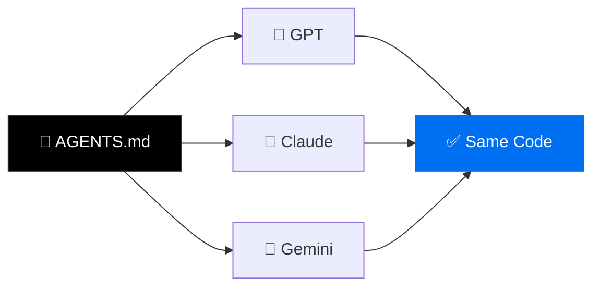

# <span class="shimmer-text">How I Orchestrated Laravel & Vue Project via AI</span>

<div v-motion :initial="{ y: 40, opacity: 0 }" :enter="{ y: 0, opacity: 1, transition: { delay: 400 } }">

## <span v-mark.highlight.yellow="1" class="text-dark">with Near-Zero Bugs</span>

</div>

<div v-motion :initial="{ opacity: 0 }" :enter="{ opacity: 0.5, transition: { delay: 800 } }" class="mt-12 text-sm">
  Making AI your <strong>most disciplined</strong> team member
</div>

<!-- floating emoji particles -->

<span class="float-particle" style="left: 5%; --dur: 7s; --delay: 0s;">🤖</span>
<span class="float-particle" style="left: 20%; --dur: 5s; --delay: 1.2s;">🚀</span>
<span class="float-particle" style="left: 40%; --dur: 8s; --delay: 0.5s;">⚡</span>
<span class="float-particle" style="left: 60%; --dur: 6s; --delay: 2s;">🧠</span>
<span class="float-particle" style="left: 75%; --dur: 7s; --delay: 0.8s;">💎</span>
<span class="float-particle" style="left: 90%; --dur: 5.5s; --delay: 1.5s;">✨</span>

---

# The Stack

<div class="grid grid-cols-4 gap-10 mt-8">
  <div v-click v-motion :initial="{ y: -80, opacity: 0, scale: 0 }" :enter="{ y: 0, opacity: 1, scale: 1, transition: { type: 'spring', stiffness: 250, damping: 12 } }" class="flex flex-col items-center gap-2">
    <logos-laravel class="text-5xl" />
    <div class="font-bold">Laravel 12</div>
  </div>
  <div v-click v-motion :initial="{ y: -80, opacity: 0, scale: 0 }" :enter="{ y: 0, opacity: 1, scale: 1, transition: { type: 'spring', stiffness: 250, damping: 12, delay: 100 } }" class="flex flex-col items-center gap-2">
    <logos-vue class="text-5xl" />
    <div class="font-bold">Vue 3</div>
  </div>
  <div v-click v-motion :initial="{ y: -80, opacity: 0, scale: 0 }" :enter="{ y: 0, opacity: 1, scale: 1, transition: { type: 'spring', stiffness: 250, damping: 12, delay: 200 } }" class="flex flex-col items-center gap-2">
    <simple-icons-inertia class="text-5xl text-blue-500" />
    <div class="font-bold">Inertia v2</div>
  </div>
  <div v-click v-motion :initial="{ y: -80, opacity: 0, scale: 0 }" :enter="{ y: 0, opacity: 1, scale: 1, transition: { type: 'spring', stiffness: 250, damping: 12, delay: 300 } }" class="flex flex-col items-center gap-2">
    <simple-icons-unocss class="text-5xl" />
    <div class="font-bold">UnoCSS</div>
  </div>
</div>

<div v-click class="mt-10 text-sm opacity-50">
  + Sail + Pest 4 + Wayfinder + shadcn-vue + Reverb
</div>

---

# The Problem

<v-clicks>

- <span v-mark.strike-through.red="1">Inconsistent code</span> - different patterns every time
- <span v-mark.strike-through.red="2">Wrong versions</span> - suggests Laravel 9 and Tailwind APIs
- <span v-mark.strike-through.red="3">Style drift</span> - every component looks different
- <span v-mark.strike-through.red="4">Skips tests</span> - "ship it" energy

</v-clicks>

<div v-click v-motion :initial="{ x: -100, opacity: 0 }" :enter="{ x: 0, opacity: 1, transition: { type: 'spring', stiffness: 200, damping: 10 } }">
<div class="mt-8 px-8 py-4 bg-red-500/10 border border-red-500/30 rounded-lg text-center text-lg shake-it pulse-glow" style="--tw-shadow-color: rgba(239,68,68,0.3)">
  🚨 Without guardrails, AI is a <span v-mark.box.red="6">junior dev who never reads the docs</span>.
</div>
</div>

---

```yaml
transition: fade
```

<div class="flex flex-col items-center justify-center h-full">
  <div v-motion :initial="{ scale: 0.3, opacity: 0 }" :enter="{ scale: 1, opacity: 1, transition: { type: 'spring', stiffness: 120, damping: 8 } }" class="text-4xl font-black text-center">
    🫣 How to fix it?
    </div>
    <div v-motion v-click :initial="{ scale: 0.3, opacity: 0 }" :enter="{ scale: 1, opacity: 1, transition: { type: 'spring', stiffness: 120, damping: 8 } }" class="text-6xl font-black text-center mt-8">
    Your AI teammate needs skills! 🤹🏼‍♂️
  </div>
</div>

---

# 🥋 Our Neo needs:

<div class="grid grid-cols-2 gap-6">
<div>

<v-clicks>

- **`AGENTS.md`** = <span v-mark.underline.green>the constitution</span>

  - Stack versions, conventions, rules

- **`.agents/skills/`** = <span v-mark.underline.green>domain experts</span>

  - Auto-activate per domain

- **`skills-lock.json`** = <span v-mark.underline.green>reproducibility</span>
  - Content hashes, like package-lock

</v-clicks>

</div>
<div v-click class="-ml-10">



</div>
</div>

---

# 📍 Version Pinning

<div class="grid grid-cols-2 gap-6 mt-2">
<div>

#### AGENTS.md

```md {all|5-8|10-12|14-16}{lines:true}
=== foundation rules ===

# Laravel Boost Guidelines

## Foundational Context

- php - v8.5.4
- laravel/framework - v12

## Skills Activation

- unocss, vue, inertia

## Conventions

- Check sibling files first
```

<div v-click class="mt-2 text-sm">

<span v-mark.highlight.yellow class="text-dark">Same file: </span> `AGENTS.md` = `CLAUDE.md` = `GEMINI.md`<br/>

</div>

</div>
<div>

#### With and without pinning

````md magic-move {lines: true}
```php
// AI generates Laravel 10 code ❌

protected $casts = [
    'email_verified_at' => 'datetime',
];

// Kernel.php (removed in L11!)
class Kernel extends HttpKernel {
    protected $middleware = [...];
}
```

```php
// AI generates Laravel 12 code ✅

protected function casts(): array
{
    return [
        'email_verified_at' => 'datetime',
    ];
}

// bootstrap/app.php
Application::configure()
    ->withMiddleware(function ($m) {
        $m->web(append: [...]);
    });
```
````

</div>
</div>

---

# 🔒 UnoCSS Style Lock

<div class="grid grid-cols-2 gap-6 mt-2">
<div>

```ts {all|6-9|10-19}
// uno.config.ts
import { defineConfig, presetWind, presetIcons } from "unocss";

export default defineConfig({
  presets: [presetWind(), presetIcons()],
  shortcuts: {
    "btn-primary": "btn bg-primary text-white",
    "card-base": "rounded-lg b bg-card p-6",
  },
  blocklist: [
    /^border$/,
    /^flex-grow$/,
    [
      new RegExp(`^shadow-(?!(?:${keys(theme.boxShadow)}|\\$)).+$`),
      {
        message: `only design system shadow values are allowed.`,
      },
    ],
  ],
});
```

</div>
<div>

<v-clicks>

- Shortcuts — reusable token combos
- Enforce short aliases: `border` -> `b`, `flex-grow` -> `grow`
- Allow shadow utilities only from the design system
- LLM naturally converges on one team style

</v-clicks>

<div v-click class="mt-4 text-sm opacity-70">
Docs: <a href="https://unocss.dev/guide/extracting#blocklist" target="_blank">unocss.dev/guide/extracting#blocklist</a>
</div>

<div v-click class="mt-4">

```html
<!-- blocked by policy -->
<div class="border flex-grow shadow-2xl">Card</div>
```

```html
<!-- project style -->
<div class="b grow shadow-card">Card</div>
```

</div>

</div>
</div>

---

# 📄 UnoCSS Skill Example

<div class="grid grid-cols-2 gap-6 mt-2">
<div>

```md {all|10-14|16-20}{maxHeight:'410px'}
## // .agents/skills/unocss/SKILL.md

name: unocss
description: Enforce one project-wide UnoCSS dialect.

---

# UnoCSS

## Preferences

- Prefer shortcuts first (`btn-primary`, `card-base`)
- Prefer short aliases: `b` over `border`, `grow` over `flex-grow`
- Use design-system shadows only (`shadow-card`, `shadow-popover`)

## Guardrails

- Block verbose aliases (`border`, `flex-grow`)
- Reject `shadow-*` values outside `theme.boxShadow`
- If style repeats, add a shortcut instead of raw utilities

## Workflow

1. Check sibling files for existing style patterns
2. Reuse shortcuts/tokens before writing raw classes
3. Keep class strings short and semantic
```

</div>
<div>

```ts {all}
// uno.config.ts
blocklist: [
  /^border$/,
  /^flex-grow$/,
  [
    new RegExp(`^shadow-(?!(?:${keys(theme.boxShadow)}|\\$)).+$`),
    {
      message: `only design system shadow values are allowed.`,
    },
  ],
];
```

<div v-click class="mt-4">

```html
<!-- not allowed -->
<div class="border flex-grow shadow-2xl">Card</div>
```

```html
<!-- expected output style -->
<div class="b grow shadow-card">Card</div>
```

</div>

</div>
</div>

---

```yaml
transition: fade
```

# 🧑‍💻 Skills = Auto-Activating Experts

```md {all|3|4|5}
## Skills Activation

- unocss -> utility conventions + shortcuts
- vue -> component patterns + composition api
- inertia -> page flow + forms + routing
```

<div v-click class="mt-4">


</div>

<div v-click class="mt-2 text-center text-sm opacity-60">
Each skill = a SKILL.md with patterns + dos and donts
</div>

---

```yaml
transition: fade
```

<div class="flex flex-col items-center justify-center h-full">
  <div v-motion :initial="{ scale: 0.3, opacity: 0 }" :enter="{ scale: 1, opacity: 1, transition: { type: 'spring', stiffness: 120, damping: 8 } }" class="text-4xl font-black text-center">
    🤔 I need to setup it somehow...
  </div>
  <div v-click v-motion :initial="{ y: 40, opacity: 0 }" :enter="{ y: 0, opacity: 1, transition: { delay: 400 } }" class="mt-8 text-8xl">
    👇
  </div>
</div>

---

# 📦 VSCode ready to go

<div class="grid grid-cols-2 gap-5 mt-2 items-start">
<div>

**1. Shows what skills are being used**


</div>
<div>

**2. Writes with focused edits**


</div>
</div>

---

```yaml
transition: fade
```

<div class="flex flex-col items-center justify-center h-full">
  <div v-motion :initial="{ scale: 0.3, opacity: 0 }" :enter="{ scale: 1, opacity: 1, transition: { type: 'spring', stiffness: 120, damping: 8 } }" class="text-4xl font-black text-center">
    😆 Vibe-coded app in prod?
    </div>
    <div v-motion v-click :initial="{ scale: 0.3, opacity: 0 }" :enter="{ scale: 1, opacity: 1, transition: { type: 'spring', stiffness: 120, damping: 8 } }" class="text-6xl font-black text-center mt-8">
    Yes! and it works great 🤌
  </div>
</div>

---

```yaml
transition: slide-up
```

<div class="">

<div v-motion :initial="{ y: 24, opacity: 0 }" :enter="{ y: 0, opacity: 1 }">
  
</div>

<div class="grid grid-cols-2 gap-4 mt-4">
  <div v-click>
    
  </div>
  <div v-click>
    
  </div>
</div>

</div>

---

```yaml
transition: slide-left
```

# 🧩 Pages Built by AI

<div class="grid grid-cols-2 gap-6 mt-2">
<div>

**You say:**

> Build Order Investigations index page.

<div v-click class="mt-2">

**LLM maps to known blocks:**

```
layouts/
└── AppLayout.vue

components/ui/
├── input/       ← search field
├── select/      ← status filter
├── table/       ← list + actions
├── badge/       ← status pill
├── button/      ← import/export
└── pagination/  ← result pages
```

</div>

</div>
<div v-click>

**LLM generates:**

```vue
<script setup lang="ts">
import AppLayout from "@/layouts/AppLayout.vue";
import { useForm } from "@inertiajs/vue3";
import { Badge } from "@/components/ui/badge";
import { Button } from "@/components/ui/button";

const props = defineProps<{
  table: TablePayload;
}>();

const form = useForm({ ...props.filters });
</script>

<template>
  <AppLayout :breadcrumbs="breadcrumbs">
    <div class="grid gap-4 p-4 md:grid-cols-3">
      <!-- cards + filters + table -->
    </div>
  </AppLayout>
</template>
```

</div>
</div>

---

```yaml
transition: slide-left
```

# 🌱 Growing the System

<div class="grid grid-cols-2 gap-6">
<div>

**Add/create component:**

```bash
npx shadcn-vue@latest add badge
```

<v-clicks>

**Describe skill:**

```md
For positive, negative, or status indicators, use Badge variants.
Don't reach for raw Tailwind colors.

Incorrect:
<span className="text-emerald-600">+20.1%</span>
<span className="text-green-500">Active</span>
<span className="text-red-600">-3.2%</span>

Correct:
<Badge variant="secondary">+20.1%</Badge>
<Badge>Active</Badge>
```

</v-clicks>

</div>
<div>

**Adding skills:**

<v-clicks>

```bash
# Community
npx skills add antfu/skills --skill='vue-best-practices'

# Custom
mkdir .agents/skills/my-skill
# Write SKILL.md inside
```

### The npm analogy:

| npm             | skills             |
| --------------- | ------------------ |
| `package.json`  | `AGENTS.md`        |
| `package-lock`  | `skills-lock.json` |
| `node_modules/` | `.agents/skills/`  |

</v-clicks>

</div>
</div>

---

```yaml
transition: slide-up
```

# 🏆 Results

<div class="grid grid-cols-3 gap-4 text-center mt-6">
  <div v-click v-motion :initial="{ y: 60, opacity: 0, scale: 0.3 }" :enter="{ y: 0, opacity: 1, scale: 1, transition: { type: 'spring', stiffness: 200, damping: 10 } }">
    <div class="px-4 py-6 rounded-xl bg-blue-500/10 border border-blue-500/30 pulse-glow">
      <div class="text-6xl font-black text-blue-400">3x</div>
      <div class="text-sm opacity-60 mt-2">faster delivery</div>
    </div>
  </div>
  <div v-click v-motion :initial="{ y: 60, opacity: 0, scale: 0.3 }" :enter="{ y: 0, opacity: 1, scale: 1, transition: { type: 'spring', stiffness: 200, damping: 10, delay: 200 } }">
    <div class="px-4 py-6 rounded-xl bg-green-500/10 border border-green-500/30 pulse-glow">
      <div class="text-6xl font-black text-green-400">~90%</div>
      <div class="text-sm opacity-60 mt-2">first-try pass rate</div>
    </div>
  </div>
  <div v-click v-motion :initial="{ y: 60, opacity: 0, scale: 0.3 }" :enter="{ y: 0, opacity: 1, scale: 1, transition: { type: 'spring', stiffness: 200, damping: 10, delay: 400 } }">
    <div class="px-4 py-6 rounded-xl bg-purple-500/10 border border-purple-500/30 pulse-glow">
      <div class="text-6xl font-black text-purple-400">0</div>
      <div class="text-sm opacity-60 mt-2">convention violations</div>
    </div>
  </div>
</div>

<v-clicks>

- **40+ components** - one style, full CRUD
- **Role-based permissions**, real-time via Reverb
- **PDF, Excel, Google Sheets** exports
- All AI-built. All production. All <span v-mark.underline.green>near-zero bugs</span>. 🎉

</v-clicks>

---

```yaml
transition: slide-up
```

# 🚀 Get Started

<div class="mt-6 space-y-3 text-xl">
  <div v-click v-motion :initial="{ x: -40, opacity: 0 }" :enter="{ x: 0, opacity: 1 }">

**1.** Create `AGENTS.md` + pin versions

  </div>
  <div v-click v-motion :initial="{ x: -40, opacity: 0 }" :enter="{ x: 0, opacity: 1, transition: { delay: 100 } }">

**2.** `npx skills add antfu/skills --skill='vue'`

  </div>
  <div v-click v-motion :initial="{ x: -40, opacity: 0 }" :enter="{ x: 0, opacity: 1, transition: { delay: 200 } }">

**3.** Add: _"Every change must be tested"_

  </div>
  <div v-click v-motion :initial="{ x: -40, opacity: 0 }" :enter="{ x: 0, opacity: 1, transition: { delay: 300 } }">

**4.** Commit + share with team

  </div>
</div>

<div v-click class="mt-8">
  <div class="text-base opacity-75">
    Also, there are ready-to-use skills for:
  </div>
  <div class="mt-3 flex flex-wrap items-center gap-3">
    <div class="flex items-center gap-2 px-3 py-2 rounded-lg border border-white/10 bg-white/5">
      
      <span class="text-sm opacity-85">Nuxt</span>
    </div>
    <div class="flex items-center gap-2 px-3 py-2 rounded-lg border border-white/10 bg-white/5">
      
      <span class="text-sm opacity-85">VueUse</span>
    </div>
    <div class="flex items-center gap-2 px-3 py-2 rounded-lg border border-white/10 bg-white/5">
      
      <span class="text-sm opacity-85">RekaUI</span>
    </div>
  </div>
</div>

<div v-click v-motion :initial="{ scale: 0.8, opacity: 0 }" :enter="{ scale: 1, opacity: 1, transition: { delay: 200 } }" class="mt-10 text-sm opacity-60">
  Your AI just got <span v-mark.circle.green>disciplined</span>.
</div>

---

```yaml
layout: cover
transition: fade
```

# 🎉 Thank You

<div class="flex gap-8 justify-center text-sm">
  <a href="https://sli.dev/" target="_blank" v-click v-motion :initial="{ y: 30, opacity: 0 }" :enter="{ y: 0, opacity: 1, transition: { delay: 100 } }" class="flex items-center gap-2">
    <carbon-document class="text-lg" />
    sli.dev
  </a>
  <div v-click v-motion :initial="{ y: 30, opacity: 0 }" :enter="{ y: 0, opacity: 1, transition: { delay: 200 } }" class="flex items-center gap-2">
    <carbon-user class="text-lg" />
    Enkot (Taras Batenkov)
  </div>
  <a href="https://github.com/enkot" target="_blank" v-click v-motion :initial="{ y: 30, opacity: 0 }" :enter="{ y: 0, opacity: 1 }" class="flex items-center gap-2">
    <carbon-logo-github class="text-lg" />
    GitHub
  </a>
</div>

<!-- confetti -->

<span class="confetti" style="left: 10%; --dur: 2.5s; --delay: 0.3s; background: #0070f3;"></span>
<span class="confetti" style="left: 25%; --dur: 3s; --delay: 0.6s; background: #22c55e;"></span>
<span class="confetti" style="left: 40%; --dur: 2.8s; --delay: 0.1s; background: #eab308;"></span>
<span class="confetti" style="left: 55%; --dur: 3.2s; --delay: 0.8s; background: #ef4444;"></span>
<span class="confetti" style="left: 70%; --dur: 2.6s; --delay: 0.4s; background: #8b5cf6;"></span>
<span class="confetti" style="left: 85%; --dur: 3s; --delay: 0.9s; background: #06b6d4;"></span>
<span class="confetti" style="left: 15%; --dur: 3.5s; --delay: 1.2s; background: #f97316;"></span>
<span class="confetti" style="left: 50%; --dur: 2.3s; --delay: 0.5s; background: #ec4899;"></span>
<span class="confetti" style="left: 75%; --dur: 2.9s; --delay: 1s; background: #14b8a6;"></span>
